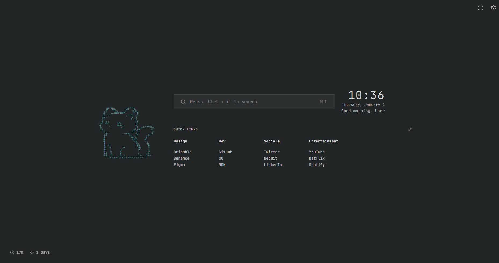

# Neko-Tab

A minimalist, highly customizable terminal-style new tab page for your browser. Built with React, TypeScript, and Vite. Designed for aesthetics, focus, and productivity.



## ✨ Features

### 🎨 Extensive Theming

Choose from over 20+ professionally crafted themes:

- **Color Themes**: Carbon, Paper, Nord, Solarized, Matrix, Dracula, Monokai, Gruvbox, Tokyo Night, Catppuccin, One Dark, Rosé Pine, Everforest.
- **Animated Themes**: Cyberpunk (neon glow), Aurora (shifting gradients), Synthwave, Vaporwave.
- **Special Effects**: Retro CRT (scanlines), Sunset, Ocean, Midnight.

### 🖥️ Modern Terminal UI

- **Centered Command Center**: Prominent clock and search bar for quick access.
- **Side-by-Side Layout**: ASCII art display matched with your organized bookmarks.
- **Smart Status Bar**: Real-time monitoring of:
  - Memory Usage (Heap size)
  - Network Connectivity Status
- **ASCII Art**: Customizable retro visuals.

### 🚀 Productivity Tools

- **Focus Mode**: Built-in Pomodoro-style timer (25 minutes) with:
  - Timer persistence across new tabs — resume where you left off
  - **Website blocking** — block distracting sites while the timer runs
  - Preset sites: Facebook, Instagram, TikTok, Twitter/X, LinkedIn, Reddit, YouTube, Netflix, Twitch
  - **Custom site blocking** — add any domain you want to block
  - Sites automatically unblock when timer is paused, reset, or completed
  - Desktop notifications when session completes
- **Quick Links**:
  - Fully customizable bookmark categories.
  - "Edit Mode" for easy management of links.
- **Keyboard Shortcuts**:
  - `CMD + K` / `CTRL + K` to focus search.
  - `CTRL + F` to toggle Focus Mode.
  - `ESC` to exit Focus Mode.

## 🛠️ Installation & Development

### Prerequisites

- Node.js (v18 or higher recommended)
- npm or yarn

### Steps

1. **Clone the repository**

   ```bash
   git clone <repository-url>
   cd Neko-Tab
   ```

2. **Install dependencies**

   ```bash
   npm install
   ```

3. **Run Development Server**

   ```bash
   npm run dev
   ```

4. **Build for Production**

   ```bash
   npm run build
   ```

## 📝 Configuration

Click the **Settings (Gear)** icon in the top-left or use the integrated settings panel to:

- Change Themes (Live Preview available).
- Update User Name.
- Toggle Status Bar.
- **Clock Format**: Switch between 12-hour and 24-hour display.
- Manage Greetings visibility.
- Upload custom images for ASCII conversion.

## 🔒 Permissions

The extension requires the following permissions:

- `topSites` — Display frequently visited sites
- `storage` — Persist settings and focus mode state
- `declarativeNetRequest` — Block distracting websites during focus sessions
- `host_permissions: <all_urls>` — Required for website blocking to work on any site

## License

MIT
