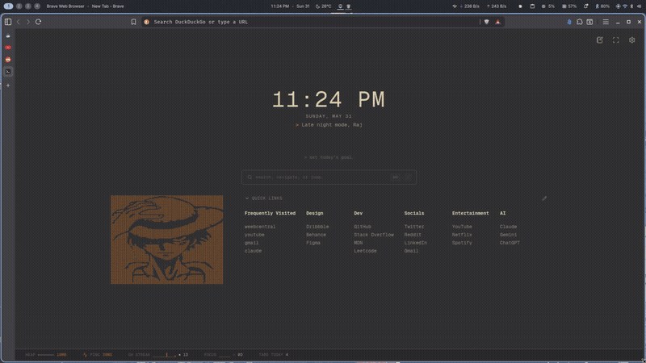

# Neko-Tab

A minimalist, terminal-style new tab page for your browser. Built with React, TypeScript, and Vite.
Designed around keyboard-first navigation, a command palette, and a clean aesthetic with zero clutter.



---

## Features

### Command Palette

Press `Ctrl+K` or `/` to open the unified command palette. It replaces the traditional search bar entirely.

- **Smart routing** — type a URL (`github.com/raj`) and it navigates directly; type a keyword and it fuzzy-searches your bookmarks and aliases; type anything else and it falls through to web search
- **URL aliases** — define short keys like `gh → https://github.com/raj` that appear first in results
- **Engine switcher** — switch between Google, DuckDuckGo, GitHub, and YouTube inside the palette
- **Fuzzy search** — matches bookmarks by title, URL, or category

### Theming

20+ professionally crafted themes across three categories:

- **Color**: Carbon, Paper, Nord, Solarized, Matrix, Dracula, Monokai, Gruvbox, Tokyo Night, Catppuccin, One Dark, Rosé Pine, Everforest
- **Animated**: Cyberpunk, Aurora, Synthwave, Vaporwave
- **Special Effects**: Retro CRT, Sunset, Ocean, Midnight

Custom background image support with adjustable dim and blur overlay.

### Scratchpad

Open with `Ctrl+\`` — a slide-in drawer with three tabs:

- **Notes** — freeform textarea with line/char counter
- **Checklist** — keyboard-driven task list (`Enter` for new item, `Backspace` on empty deletes); checked items auto-clear on close
- **Journal** — daily log keyed by date; past days accessible via nav buttons

### Font Chooser

Pick from 12 curated monospace fonts in Settings → Appearance. Fonts load lazily — only the selected font is fetched, not all of them upfront.

- **Modern**: Geist Mono, Commit Mono, Intel One Mono
- **Popular**: JetBrains Mono (default), Fira Code, Cascadia Code
- **Character**: Space Mono, Iosevka, IBM Plex Mono, Inconsolata, Source Code Pro, Hack

### Recent History in Command Palette

When you open `Ctrl+K` with an empty query, the last 10 visited URLs and searches appear instantly. Deduped by URL, newest first. Clear history button in the hint row.

### Work Timer

Lives in the status bar. `Ctrl+Shift+T` or click to start/stop. Shows elapsed time in `hh:mm:ss`.
Persists across tab reloads — closing a tab mid-session doesn't lose your time.

### Daily Goal

A single focus line between the clock and command palette. Click to edit, resets at midnight.

### Bookmarks

A two-column quick-links panel below the command palette. Fully editable without leaving the tab:

- Add/delete/rename categories
- Add, edit, and delete individual links per category
- All data stored locally — no sync, no account

### Focus Mode

`Ctrl+F` or the crosshair icon (top-right) to open. Pomodoro-style 25-minute timer with website blocking:

- Preset distractions: Facebook, Instagram, TikTok, Twitter, X.com, LinkedIn, Reddit, YouTube, Netflix, Twitch
- Add custom domains to block
- Sites unblock automatically when timer ends or is reset
- Desktop notification + sound on completion

### Status Bar

- **HEAP** — JS heap memory usage with a live bar (Chrome only)
- **PING** — real latency via `1.1.1.1` (not just `navigator.onLine`)
- **GitHub Streak** — contribution streak with 14-day sparkline (optional, no auth needed)
- **Work Timer** — always visible when running

### Keyboard Shortcuts

Press `?` anywhere to show the full shortcut cheatsheet.

| Shortcut | Action |
|---|---|
| `Ctrl+K` or `/` | Open command palette |
| `Ctrl+\`` | Toggle scratchpad |
| `Ctrl+Shift+T` | Start / stop work timer |
| `Ctrl+F` | Open / close Focus Mode |
| `?` | Show shortcut help |
| `Escape` | Close any open panel |
| `↑ / ↓` | Navigate palette results |
| `Enter` | Open selected result |
| `Enter / Escape` | Confirm / cancel daily goal edit |
| `Enter` | New checklist item (scratchpad) |
| `Backspace` | Delete empty checklist item |

---


## Installation

### Pre-built package

1. Enable Developer mode in Chrome's extensions page.
2. Download the [latest release](https://github.com/uddin-rajaul/Neko-Tab/releases/latest).
3. Drag-and-drop the zip file in the Chrome's extensions page.


### Development

```bash
git clone https://github.com/uddin-rajaul/Neko-Tab
cd neko-tab
npm install
npm run dev
```

### Load as a browser extension

```bash
npm run build
```

Then in Chrome/Edge: **Extensions → Load unpacked → select the `dist/` folder**.

---

## Settings

Open the gear icon (top-right) to access:

- **Appearance** — theme picker with live preview, font chooser
- **Preferences** — name, clock format, display toggles
- **ASCII Art** — image-to-ASCII converter or paste custom art
- **Widgets** — background image, daily goal, GitHub streak
- **Aliases** — define short URL aliases for the command palette

---

## Permissions

| Permission | Why |
|---|---|
| `storage` | Persist settings, bookmarks, scratchpad, aliases, timer state |
| `declarativeNetRequest` | Block sites during Focus Mode sessions |
| `host_permissions: <all_urls>` | Required for site blocking to apply on any domain |

---

## Privacy

No data leaves your browser. Everything is stored locally via the browser `storage` API.
No analytics, no tracking, no external servers — except searches you explicitly initiate.

---

## Tech Stack

- React + TypeScript
- Vite
- Tailwind CSS
- Lucide React (icons)
- JetBrains Mono (default font), 11 more via lazy Google Fonts loading

---

## Support

If Neko-Tab saves you time or you just like what it does, a small contribution goes a long way.

**eSewa (Nepal):** `9823211188`

No pressure — the project is and will always be free and open source.

---

## License

MIT
